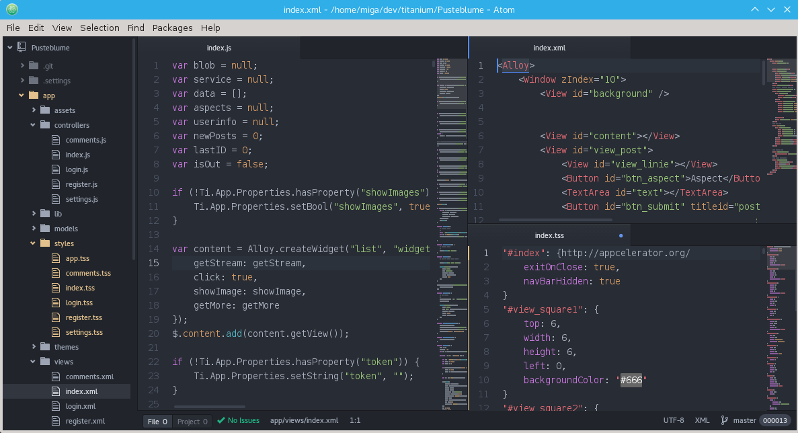

# Getting started with Appcelerator Titanium (OSS Version) and Atom

Since version 4 of Appcelerator Titanium there are two version of Titanium: the 'Appcelerator Platform' (with Appcelerator Studio, Arrow,..) and the open source version 'Appcelerator Titanium' (http://appcelerator.org/).
In this tutorial I'm talking about a way to get started with the open source Titanium in combination with Atom as an editor on Linux (you could use other editors like Sublime, but that's not part of this tutorial).

## Installing Appcelerator Titanium

The current 'general availability' version of the SDK is 4.1.0GA

At first we need to setup Titanium:
* command line tools (CLI) to compile the apps
* the MVC framework Alloy
* some useful tools
* the SDK

The main parts are installed using the node.js package manager 'npm'. Check https://nodejs.org/ if you need to install it.

Now open a console and run the following command to install the tools:

~~~
npm install -g titanium alloy tisdk
~~~

After that we need to install the SDK. To do this we will the cli tool tisdk from David Bankier (https://github.com/dbankier/tisdk):

~~~
# list sdks
tisdk list
~~~

The output will be something like this

~~~
4.1.0.GA
4.1.0.Beta
4.0.0.RC5
4.0.0.RC4
4.0.0.RC3
4.0.0.RC2
4.0.0.RC
4.0.0.GA
4.0.0.Beta4
4.0.0.Beta3
4.0.0.Beta2
3.5.1.RC
3.5.1.GA
3.5.1.Alpha
3.5.0.RC3
3.5.0.RC2
3.5.0.RC
~~~

From this list we select the latest GA (4.1.0) and istall it

~~~
tisdk install 4.1.0.GA
~~~

You are ready to create titanium/alloy projects now and compile them! Time to setup the editor

## Install atom and some useful packages

Goto https://atom.io/ and install the atom editor.

When you have it running open the settings (strg + ,) and install some packages:

* TSS language (highlight for TSS files, https://atom.io/packages/language-tss)
* ti-create (create projects, controllers and widgets, https://atom.io/packages/ti-create)
* minimap (small map of your code)
* minimap-highlight-selected (shows current selected words in the minimap)
* highlight-selected (highlight all occurrences of your current selection)
* pigments (shows the color of your hex values)
* Linter
* more to come

## Create your first app

For this tutorial we are just creating an empty Alloy app using CLI and Atom.

Open a new terminal and add the following :
~~~
ti create -id com.test -d . -n APPNAME -p all -t app -u http://migaweb.de
cd APPNAME/
alloy new
~~~

This will create a basic app and the convert it into an Alloy project.

You can also use the Atom package ti-create

It will create a new project inside the folder that is open in the tree-view. 'Create controller/widget' only work inside an existing Alloy project ("Open folder" - select the project folder).

## Compile your app

There are several ways to compile your app. You can use the simulator/emulator, deploy it to your device or create store apk's/ipa's. There is also a live test tool (TiShadow) which saves you a lot of time waiting for the compiler.

### cli way

~~~
# android to device
ti build -p android  -T device

# android to store/file
ti build -p android -K /home/user/keyfile.keystore -T dist-playstore
~~~

### Shortcuts

You can save yourself a lot of typing when you define some aliases (e.g. 'tq' will run the whole ti command to compile it and deploy it to the connected android device)
In Linux/OSX you open the .bashrc file and add the following aliases:

~~~
alias tq='ti build -p android  -T device --skip-js-minify'
alias tbs='ti build -p android -K /home/user/keyfile.keystore -T dist-playstore'
~~~
then you can just write "tq" to compile and install on your connected device or write "tbs" to build an apk for the play store.

### TiShadow

TiShadow is another great tool by David Bankier (https://github.com/dbankier/TiShadow)

_TiShadow provides Titanium developers the ability to deploy apps, run tests or execute code snippets live across all running iOS and Android devices._

It allows you to quickly test your app on multiple devices at the same time and 'compiles' quicker then building your app all the time (about 5 seconds to get your app up and running on an android phone, for a small app). Also it works wlan, so you don't have to have your device connected.

## Link list

Here are some useful Titanium ressources:

* Appcelerator Plattform: http://appcelerator.com
* Appcelerator Titainum (OSS): http://appcelerator.org
* Appcelerator Community: https://community.appcelerator.com/
* Ti-Slack: https://ti-slack.slack.com/
* tisdk: https://github.com/dbankier/tisdk
* TiShadow: https://github.com/dbankier/TiShadow
* Atom: http://atom.io
* tidev: http://www.tidev.io/
* gitt.io: http://gitt.io/
